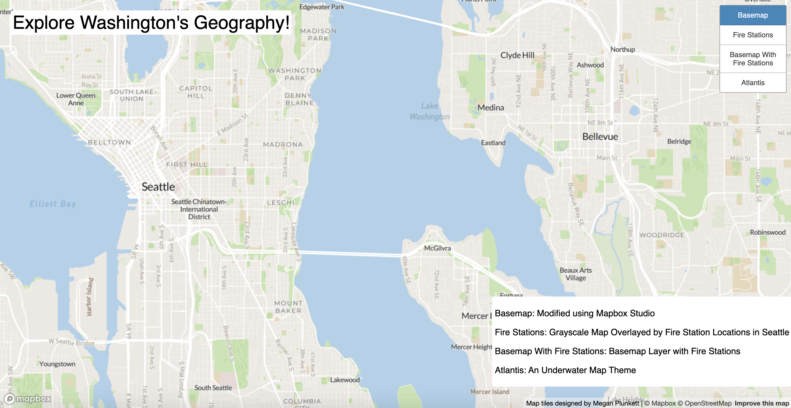
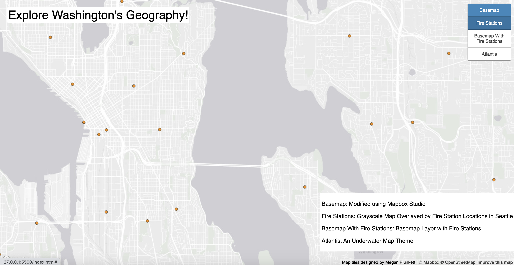
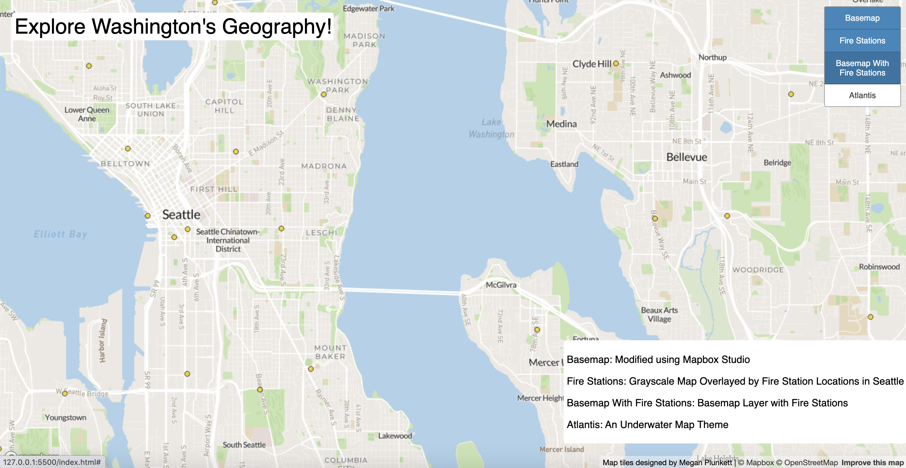
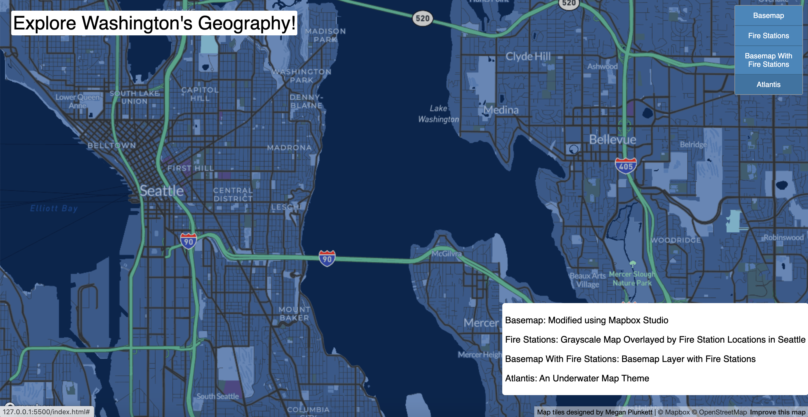

# Exploring Washington's Geography
by Megan Plunkett

## Project Overview
The following URL links to a web map, which looks at the examined area of Seattle and surrounding King County using tile sets. We have a basic basemap, a second grayscale map, highlighting fire stations with points, a third basemap overlayed by these points, and a themed map.

[URL to Web Map:] ()

## Tileset 1: Basemap
### **Brief Description:** 
For basemap one, I chose to use a basic, semi-muted color palette. I kept colors true to landmark (e.g. water is blue), and changed the font to make it more legible and aesthetic. 

This map consists of zoom levels 0-15. 

## Tileset 2: Fire Stations
### **Brief Description:** 
For the second map, I chose to use a grayscale map underneath the fire station points to contextualize, where each point is in space. I chose the color orange, as it's bold, but not distracting. 

This map consists of zoom levels 0-15. 

## Tileset 3: Basemap With Fire Stations
### **Brief Description:**  
The third map combines the basemap and the second fire station layer. Here, we have a broader picture of not only fire stations, but nearby neighborhoods and areas of interest. 

This map consists of zoom levels 0-15.

## Tileset 4: Atlantis
### **Brief Description:** 
Finally, I chose an underwater theme for our themed map. I thought that the juxtaposition between fire stations and water made for an interesting project.

This map consists of zoom levels 0-15.

